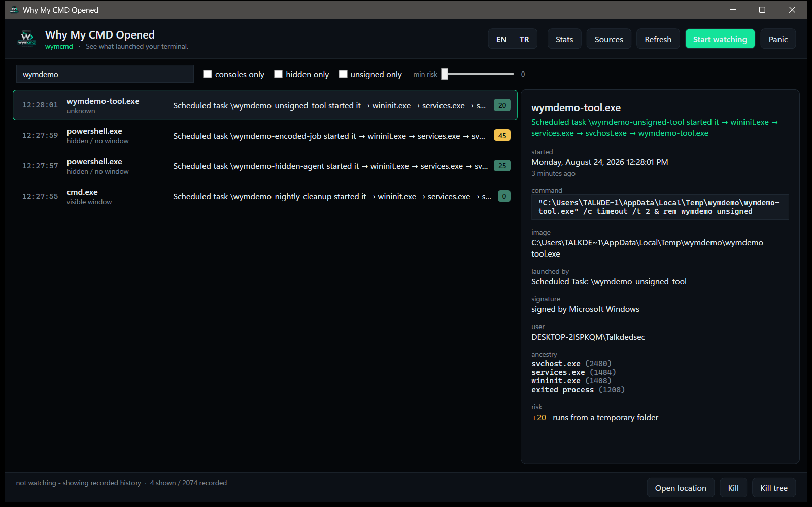

<p align="center">
  
</p>

<h1 align="center">Why My CMD Opened</h1>

<p align="center">
  <b>A console window flashed on your screen and vanished. This tells you what opened it, and why.</b>
</p>

<p align="center">
  
  
  
  
  
</p>

<p align="center">
  <a href="README.tr.md">Türkçe</a> ·
  <a href="#quickstart">Quickstart</a> ·
  <a href="#commands">Commands</a> ·
  <a href="#how-it-knows">How it knows</a> ·
  <a href="#privacy">Privacy</a>
</p>

---

Task Manager is already empty by the time you look. Process Monitor tells you *that* something
ran, never *why*. **wymcmd** — the command you type — answers the question you actually have:
**which scheduled task, registry key, service, document or click started that console**, and it
answers it for launches that happened while wymcmd itself was not running.

```console
> wymcmd why last

cmd.exe  (pid 24188)
Scheduled task \Microsoft\Windows\UpdateOrchestrator\Reboot started it -> svchost.exe -> cmd.exe

started        Monday, 24 August 2026 03:11:04  (7 hours ago)
lifetime       42 ms
image          C:\Windows\System32\cmd.exe
command        cmd.exe /c shutdown /r /f /t 0
signature      signed by Microsoft Windows
window         hidden / no window
launched by    Scheduled Task: \Microsoft\Windows\UpdateOrchestrator\Reboot
confidence     certain
evidence       BlackBox, SecurityLog, TaskLog

execution history
  Prefetch     24.08.2026 03:11  (7 hours ago)
  UserAssist   21.08.2026 19:40  (3 days ago)  12 runs

risk: 25/100
  +25  no visible window
```

<p align="center">
  
</p>

## Nothing runs in the background

That is a design decision, not a missing feature. There are five ways for wymcmd to know what
happened, and only the last one is a resident process — it ships **disabled**.

| Mode | Resident process | What you get |
|---|:---:|---|
| **Forensic** — default | none | Rebuilds history from what Windows already recorded: Security log 4688/4689, Sysmon, Task Scheduler, PowerShell script blocks, Prefetch, BAM, UserAssist |
| **Black box** — recommended | **none** | An ETW AutoLogger that *Windows itself* starts at boot and writes into a capped circular file. No process of ours in memory, no CPU while idle, full fidelity waiting for you when you open the tool |
| **Live** | only while open | Real-time kernel tracing while `wymcmd watch` or the window is open |
| **Trap** | until it expires | "Catch it if it happens again", with a deadline; it closes itself |
| **Watchdog service** | yes, opt-in | Round-the-clock rule enforcement, for people who want it |

```console
wymcmd doctor           # what this machine can currently tell you
wymcmd sources enable   # let Windows record process creation with command lines
wymcmd blackbox on      # boot-time recorder, still no resident process
```

## Quickstart

```console
wymcmd                     # the window
wymcmd doctor              # see what is available, and what is missing
wymcmd sources enable      # one-time, elevated, fully reversible
wymcmd blackbox on         # optional: never miss anything again, with nothing resident
wymcmd why last            # what opened that console?
```

Nothing is enabled behind your back: `sources enable` and `blackbox on` are the only commands
that change the machine, both are explicit, and `wymcmd uninstall --purge` puts everything back.

## What it figures out

- **Who started it** — the full ancestor chain, including parents that exited long ago
- **Why it started** — Scheduled Task (by name), Run key, Startup folder, service, WMI
  subscription, Image File Execution Options, installer, Office document, browser download,
  a terminal, or you double-clicking
- **What it ran** — `-EncodedCommand` decoded into the real script, `cmd /c` unwrapped, the
  actual script block recovered from PowerShell logging
- **Whether it had a window** — a console with no window is the strongest signal that something
  did not want to be seen. Catalog-signed Windows binaries are recognised properly, so system
  tools are never mislabelled as unsigned
- **Whether this binary is a regular here** — Prefetch, BAM and UserAssist answer "first time
  today" versus "runs every morning"
- **How worried to be** — a 0-100 score that always shows its reasons

## Commands

```console
wymcmd                          # the window
wymcmd why <pid|last>           # explain one launch, retroactively when needed
wymcmd timeline 14:22           # everything that happened around a moment
wymcmd list --last 24h --console --hidden --unsigned --risk 50
wymcmd watch --console          # live stream for as long as this window is open
wymcmd trap --image cmd.exe --hidden-only --for 2h --action killtree
wymcmd tree [pid]
wymcmd kill <pid> [--tree]
wymcmd rules add --image cmd.exe --match "downloadstring" --action kill
wymcmd rules test               # what your rules would have done over recorded history
wymcmd export --since 24h --format csv|jsonl|report [--forensic]
wymcmd blackbox on|off|status
wymcmd sources enable|status
wymcmd service install|start|stop|uninstall
wymcmd doctor
wymcmd uninstall --purge        # revert every change, delete every file
```

Every command takes `--json` (machine-readable, keys always in English) and `--lang en|tr`.
Exit codes mean something: `0` ok, `2` needs administrator, `3` a data source is off, `4` nothing matched.

## Rules

Rules run in live, trap and watchdog mode only — watching never changes your machine on its own.

```console
wymcmd rules add --image powershell.exe --hidden --unsigned --action killtree --name "hidden unsigned shells"
```

Match on image, path, command line regex, parent, any ancestor, signer, user, session, window
state, elevation, temp paths, or risk score. Actions: `log`, `notify`, `hide`, `suspend`, `kill`,
`killtree`, and `allow` to whitelist. Adding a rule immediately reports how often it *would* have
fired across your recorded history, so nothing gets armed blindly.

`csrss.exe`, `lsass.exe`, `services.exe`, `winlogon.exe` and friends are refused by a guard that
no flag can bypass.

## How it knows

Every field carries where it came from, and the answer says how sure it is.

| Evidence | Gives | Needs |
|---|---|---|
| ETW kernel tracing | Every start, with the command line, even at 30 ms | administrator, while watching |
| Black box (AutoLogger) | The same fidelity for the past, with nothing resident | one-time setup, elevated |
| Security log 4688/4689 | Start, parent, command line, exit status | `wymcmd sources enable` |
| Sysmon event 1 | Hashes, parent command line, integrity level | Sysmon, if you run it |
| Task Scheduler log | The task name behind a launch, by pid | `wymcmd sources enable` |
| PowerShell 4104 | The script that actually ran, deobfuscated | `wymcmd sources enable` |
| Prefetch / BAM / UserAssist | When this binary last ran, how often | administrator for some |
| WMI polling | A fallback when nothing else is available | nothing — and it says what it misses |

The verdict is labelled `certain`, `high` or `inferred`, and the detail pane shows which source
each field came from. Nothing is invented to fill a gap.

## Privacy

Everything stays on the machine: one SQLite database under `%ProgramData%\wymcmd`
(`%LOCALAPPDATA%\wymcmd` when not elevated). No telemetry, no network calls, no auto-update.
The optional hash lookup is off by default and never turns itself on.

`wymcmd uninstall --purge` reverts the audit policy changes it made (and only those — it keeps a
journal), removes the black box and its trace, removes the service, and deletes the data.

## Language

English is the source language, Turkish is a complete translation — window, CLI output, help
text, error messages and exported reports. `--lang tr`, or the EN/TR switch in the window.

<p align="center">
  
</p>

## Install

Grab the zip from [releases](https://github.com/Talkdedsec1/wymcmd/releases), unpack it, and put
the folder on your `PATH`. Nothing to install, no runtime to fetch: the executable is
self-contained.

The zip holds two files that belong together:

| File | What it is |
|---|---|
| `wymcmd.exe` | The tool. Double-click it for the window. |
| `wymcmd.com` | A 1 MB console launcher. Windows shells resolve `.com` before `.exe`, so typing `wymcmd list` runs this, which waits for the tool to finish and passes its exit code back. Without it a shell would return the prompt immediately and your redirection would race the output. |

## Build from source

Requires the [.NET 10 SDK](https://dotnet.microsoft.com/download). The launcher is compiled
ahead of time, which needs the Visual Studio C++ build tools; skip that step if you only want
the window.

```console
git clone https://github.com/Talkdedsec1/wymcmd
cd wymcmd
dotnet publish src/Wymcmd/Wymcmd.csproj -c Release -o publish
dotnet publish src/WymcmdShim/WymcmdShim.csproj -c Release -o launcher
copy launcher\wymcmd-launcher.exe publish\wymcmd.com
```

Repository layout: `src/Wymcmd/Core` holds capture, forensics, attribution, rules and storage;
`Cli` and `Views`/`ViewModels` are two front ends over the same engine; `scripts/` carries the
translation gate, the scenario generator and the capture load test.

## License

Source-available, **not** open source: free to use, **no modification, no redistribution, no
resale**. See [LICENSE](LICENSE).

<p align="center">
  <sub>Built by <a href="https://talkdedsec.com">Talkdedsec</a></sub>
</p>
