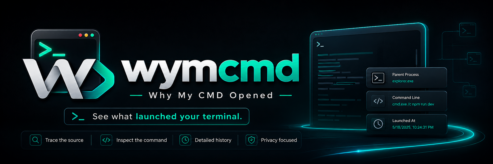
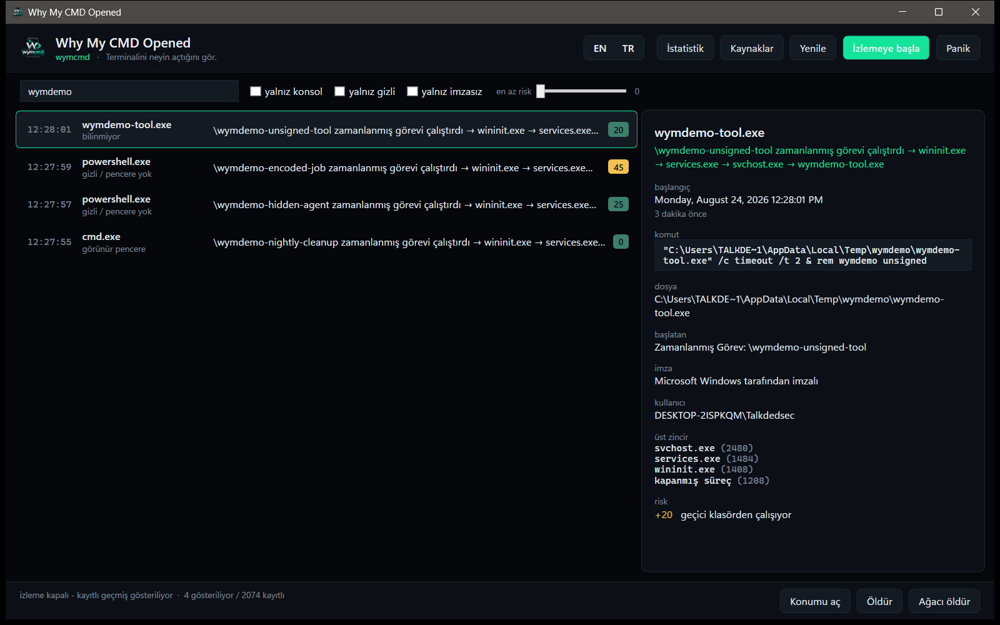

<p align="center">
  
</p>

<h1 align="center">Why My CMD Opened</h1>

<p align="center">
  <b>Ekranda bir konsol penceresi parladı ve kayboldu. Onu neyin açtığını burada görürsün.</b>
</p>

<p align="center">
  
  
  
  
  
</p>

<p align="center">
  <a href="README.md">English</a> ·
  <a href="#h%C4%B1zl%C4%B1-ba%C5%9Flang%C4%B1%C3%A7">Hızlı başlangıç</a> ·
  <a href="#komutlar">Komutlar</a> ·
  <a href="#nas%C4%B1l-biliyor">Nasıl biliyor</a> ·
  <a href="#gizlilik">Gizlilik</a>
</p>

---

Sen bakana kadar Görev Yöneticisi çoktan boşalmış oluyor. Process Monitor bir şeyin çalıştığını
söylüyor, *neden* çalıştığını değil. **wymcmd** — yazdığın komut — asıl merak ettiğini
cevaplıyor: **o konsolu hangi zamanlanmış görev, hangi Run anahtarı, hangi servis, hangi belge
ya da hangi tıklama açtı** — üstelik wymcmd hiç çalışmıyorken olmuş açılışlar için de.

```console
> wymcmd why last --lang tr

cmd.exe  (pid 24188)
\Microsoft\Windows\UpdateOrchestrator\Reboot zamanlanmış görevi çalıştırdı → svchost.exe → cmd.exe

başlangıç      24 Ağustos 2026 Pazartesi 03:11:04  (7 saat önce)
ömür           42 ms
dosya          C:\Windows\System32\cmd.exe
komut          cmd.exe /c shutdown /r /f /t 0
imza           Microsoft Windows tarafından imzalı
pencere        gizli / pencere yok
başlatan       Zamanlanmış Görev: \Microsoft\Windows\UpdateOrchestrator\Reboot
güven          kesin
kanıt          BlackBox, SecurityLog, TaskLog

çalışma geçmişi
  Prefetch     24.08.2026 03:11  (7 saat önce)
  UserAssist   21.08.2026 19:40  (3 gün önce)  12 kez çalışmış

risk: 25/100
  +25  görünür pencere yok
```

<p align="center">
  
</p>

## Arka planda hiçbir şey çalışmıyor

Bu eksik bir özellik değil, bilinçli bir karar. wymcmd'nin olan biteni öğrenmek için beş yolu
var; yalnızca sonuncusu yerleşik bir süreç ve o da **kapalı geliyor**.

| Mod | Yerleşik süreç | Ne veriyor |
|---|:---:|---|
| **Adli** — varsayılan | yok | Windows'un zaten tuttuğu kayıtlardan geçmişi geri kurar: Güvenlik günlüğü 4688/4689, Sysmon, Görev Zamanlayıcı, PowerShell script blokları, Prefetch, BAM, UserAssist |
| **Kara kutu** — önerilen | **yok** | Açılışta **Windows'un kendisinin** başlattığı bir ETW AutoLogger, tavanı belli dairesel dosyaya yazar. Bellekte bize ait hiçbir şey yok, boştayken CPU maliyeti yok; aracı açtığında tam kayıt hazır bekliyor |
| **Canlı** | yalnızca açıkken | `wymcmd watch` ya da pencere açıkken gerçek zamanlı çekirdek izleme |
| **Tuzak** | süresi dolana kadar | "Bir daha olursa yakala", süreli; süre bitince kendini kapatır |
| **Nöbet servisi** | evet, isteğe bağlı | 7/24 kural uygulaması isteyenler için |

```console
wymcmd doctor           # bu makine şu an neyi söyleyebiliyor
wymcmd sources enable   # Windows süreç oluşturmayı komut satırıyla kaydetsin
wymcmd blackbox on      # açılış kaydı, yine yerleşik süreç yok
```

## Hızlı başlangıç

```console
wymcmd                     # pencere
wymcmd doctor              # ne var, ne eksik
wymcmd sources enable      # tek seferlik, yönetici gerekir, tamamen geri alınabilir
wymcmd blackbox on         # isteğe bağlı: bir daha hiçbir şey kaçmasın, yerleşik süreç olmadan
wymcmd why last            # o konsolu ne açtı?
```

Arkandan hiçbir şey açılmıyor: makineyi değiştiren tek iki komut `sources enable` ve
`blackbox on`, ikisi de açıkça isteniyor, `wymcmd uninstall --purge` hepsini geri alıyor.

## Gerçekte ne çıkarıyor

- **Kim başlattı** — kök sürece kadar tüm üst zincir, çoktan kapanmış üstler dahil
- **Neden başladı** — Zamanlanmış Görev (adıyla), Run anahtarı, Başlangıç klasörü, servis, WMI
  aboneliği, Image File Execution Options, kurulum programı, Office belgesi, tarayıcı indirmesi,
  bir terminal ya da senin çift tıklaman
- **Ne çalıştırdı** — `-EncodedCommand` çözülüp gerçek script gösterilir, `cmd /c` sarması
  açılır, PowerShell kaydından gerçek script bloğu getirilir
- **Penceresi var mıydı** — penceresiz bir konsol, bir şeyin görünmek istemediğinin en güçlü
  işaretidir. Katalog imzalı Windows dosyaları doğru tanınır; sistem araçları asla "imzasız"
  diye yaftalanmaz
- **Bu dosya burada tanıdık mı** — Prefetch, BAM ve UserAssist "bugün ilk kez" ile "her sabah
  çalışıyor" arasındaki farkı söyler
- **Ne kadar endişelenmeli** — 0-100 arası skor, ama her zaman gerekçeleri açık

## Komutlar

```console
wymcmd                          # pencere
wymcmd why <pid|last>           # tek bir açılışı açıkla, gerekirse geçmişe dönük
wymcmd timeline 14:22           # o anın etrafında olan her şey
wymcmd list --last 24h --console --hidden --unsigned --risk 50
wymcmd watch --console          # bu pencere açık kaldığı sürece canlı akış
wymcmd trap --image cmd.exe --hidden-only --for 2h --action killtree
wymcmd tree [pid]
wymcmd kill <pid> [--tree]
wymcmd rules add --image cmd.exe --match "downloadstring" --action kill
wymcmd rules test               # kuralların kayıtlı geçmişte ne yapmış olacağı
wymcmd export --since 24h --format csv|jsonl|report [--forensic]
wymcmd blackbox on|off|status
wymcmd sources enable|status
wymcmd service install|start|stop|uninstall
wymcmd doctor
wymcmd install                  # wymcmd'yi PATH'e koy (kullanıcı bazlı, yönetici gerekmez)
wymcmd uninstall --purge        # her değişikliği geri al, her dosyayı sil
```

Her komut `--json` (makine-okunur, anahtarlar hep İngilizce) ve `--lang en|tr` destekler.
Çıkış kodları anlamlı: `0` tamam, `2` yönetici gerekiyor, `3` veri kaynağı kapalı, `4` eşleşme yok.

## Kurallar

Kurallar yalnızca canlı, tuzak ve nöbet modunda çalışır — izlemek tek başına makineni değiştirmez.

```console
wymcmd rules add --image powershell.exe --hidden --unsigned --action killtree --name "gizli imzasız kabuk"
```

Eşleşme alanları: dosya adı, yol, komut satırı regex'i, üst süreç, zincirdeki herhangi bir ata,
imzalayan, kullanıcı, oturum, pencere durumu, yükseltilmişlik, temp yolu ve risk skoru.
Aksiyonlar: `log`, `notify`, `hide`, `suspend`, `kill`, `killtree` ve beyaz liste için `allow`.
Kural eklendiği anda kayıtlı geçmişte kaç kez eşleşeceği gösterilir — kör kural kurulmaz.

`csrss.exe`, `lsass.exe`, `services.exe`, `winlogon.exe` ve benzerlerini hiçbir bayrakla
atlatılamayan bir koruma reddeder.

## Nasıl biliyor

Her alan nereden geldiğini taşır, cevap da ne kadar emin olduğunu söyler.

| Kanıt | Ne veriyor | Ne gerekiyor |
|---|---|---|
| ETW çekirdek izleme | Her açılışı, komut satırıyla, 30 ms'lik olanı bile | yönetici, izlerken |
| Kara kutu (AutoLogger) | Aynı sadakati geçmiş için, yerleşik süreç olmadan | tek seferlik kurulum, yönetici |
| Güvenlik günlüğü 4688/4689 | Açılış, üst süreç, komut satırı, çıkış kodu | `wymcmd sources enable` |
| Sysmon olay 1 | Hash, üst komut satırı, bütünlük seviyesi | Sysmon kuruluysa |
| Görev Zamanlayıcı günlüğü | Açılışın arkasındaki görev adını, pid üzerinden | `wymcmd sources enable` |
| PowerShell 4104 | Gerçekte çalışan script, gizlenmemiş hâliyle | `wymcmd sources enable` |
| Prefetch / BAM / UserAssist | Bu dosya en son ne zaman, kaç kez çalışmış | bazıları için yönetici |
| WMI yoklama | Başka hiçbir şey yokken yedek | hiçbir şey — ve neyi kaçırdığını söyler |

Sonuç `kesin`, `yüksek` ya da `çıkarım` olarak etiketlenir; detay panelinde her alanın hangi
kaynaktan geldiği görünür. Boşluk doldurmak için hiçbir şey uydurulmaz.

## Gizlilik

Her şey makinende kalır: `%ProgramData%\wymcmd` (yönetici değilken `%LOCALAPPDATA%\wymcmd`)
altında tek bir SQLite veritabanı. Telemetri yok, ağ çağrısı yok, otomatik güncelleme yok.
İsteğe bağlı hash sorgusu varsayılan olarak kapalıdır ve kendiliğinden açılmaz.

`wymcmd uninstall --purge` yaptığı denetim politikası değişikliklerini geri alır (yalnız kendi
yaptıklarını — bir günlük tutuyor), kara kutuyu ve kaydını kaldırır, servisi siler, veriyi siler.

## Dil

Kaynak dil İngilizce, Türkçe tam çeviri — pencere, CLI çıktısı, yardım metni, hata mesajları ve
dışa aktarılan raporlar dahil. `--lang tr` ya da penceredeki EN/TR anahtarı.

## Kurulum

[Releases](https://github.com/Talkdedsec1/tlk-wymcmd/releases) sayfasından zip'i indir, istediğin
yere aç ve şunu çalıştır:

```console
wymcmd install
```

İki dosyayı `%LOCALAPPDATA%\Programs\wymcmd` altına kopyalar, o klasörü PATH'e ekler ve başlat
menüsüne kısayol koyar. Yönetici yok, kurulum sihirbazı yok; geri almak da `wymcmd uninstall`.
Sonrasında yeni bir terminal aç, `wymcmd` her klasörde çalışır.

Taşınabilir kalsın mı istiyorsun? Kurulumu atla, açtığın yerden çalıştır. Çalıştırılabilir dosya
kendi kendine yeter, iki durumda da indirilecek bir runtime yok.

Zip'in içinde birbirine ait iki dosya var:

| Dosya | Ne işe yarıyor |
|---|---|
| `wymcmd.exe` | Aracın kendisi. Çift tıklarsan pencere açılır. |
| `wymcmd.com` | 1 MB'lık konsol başlatıcısı. Windows kabukları `.com` uzantısını `.exe`'den önce çözer; `wymcmd list` yazdığında bu çalışır, aracın bitmesini bekler ve çıkış kodunu geri verir. O olmadan kabuk komut istemini hemen döndürür ve yönlendirdiğin çıktı yarışa girer. |

## Kaynaktan derleme

[.NET 10 SDK](https://dotnet.microsoft.com/download) gerekir. Başlatıcı önceden derlendiği için
Visual Studio C++ build tools ister; yalnız pencereyi istiyorsan o adımı atlayabilirsin.

```console
git clone https://github.com/Talkdedsec1/tlk-wymcmd
cd wymcmd
dotnet publish src/Wymcmd/Wymcmd.csproj -c Release -o publish
dotnet publish src/WymcmdShim/WymcmdShim.csproj -c Release -o launcher
copy launcher\wymcmd-launcher.exe publish\wymcmd.com
```

Depo düzeni: `src/Wymcmd/Core` yakalama, adli katman, atıf, kurallar ve depolamayı barındırır;
`Cli` ile `Views`/`ViewModels` aynı motorun iki yüzüdür; `scripts/` çeviri kapısını, senaryo
üreticisini ve yakalama yük testini taşır.

## Lisans

Kaynağı açık, **açık kaynak değil**: kullanımı serbest, **değiştirme yok, yeniden dağıtma yok,
satma yok**. Bkz. [LICENSE](LICENSE).

<p align="center">
  <sub><a href="https://talkdedsec.com">Talkdedsec</a> tarafından yapıldı</sub>
</p>
